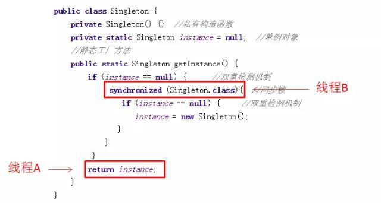
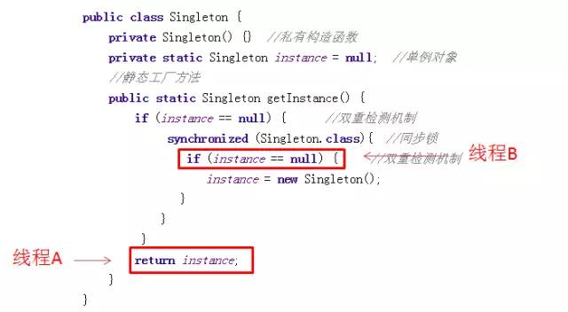

---

typora-copy-images-to: raw\pic
---


## 单例模式

##### 单例模式第一版：

```java
public class Singleton {
    private Singleton() {}  //私有构造函数
    private static Singleton instance = null;  //单例对象
    //静态工厂方法
    public static Singleton getInstance() {
        if (instance == null) {
            instance = new Singleton();
        }
        return instance;
    }
}
```

关键点：

1. 想要让一个类只能构建一个对象，自然不能让它随便去做new操作，因此Singleton的构造方法是私有的。
2. instance是Singleton类的静态成员。也是我们的单例对象。它的初始值可以写成Null，也可以写成new Singleton()。
3. getInstance是获取单例对象的方法。

如果单例初始值是null，还未构建，则构建单例对象并返回。这种写法属于单例模式当中的懒汉模式；如果单例对象一开始就被new Singleton()主动构建，则不再需要判断空操作，这种写法属于饿汉模式。

这两个名字很形象：饿汉主动找食物吃，懒汉躺在地上等着人喂。

**然而上述代码不是线程安全的。**

因为Instance是空，所以两个线程同时通过了条件判断，开始执行new操作：


这样一来，显然instance被构建了两次。让我们对代码做一下修改：

***

##### 单例模式第二版

```java
public class Singleton {
   private Singleton() {}  //私有构造函数
   private volatile static Singleton instance = null;  //单例对象
   //静态工厂方法
   public static Singleton getInstance() {
   	if (instance == null) {      //双重检测机制
        	synchronized (Singleton.class){  //同步锁
              if (instance == null) {     //双重检测机制
                instance = new Singleton();
                   }
            	}
        	 }
    		return instance;
       }
}
```

为什么这样写呢？我们来解释几个关键点：

1. 为了防止new Singleton被执行多次，因此在new操作之前加上Synchronized同步锁，锁住整个类(这里不能使用对象锁)。
2. 进入Synchronized临界区以后，还要再做一次判空。因为当两个线程同事访问的时候，线程A构建完对象，线程B也已经通过了最初的判空阶段，不做第二次判空的话，线程B还是会再次构建instance对象。







像这样两次判空的机制叫做双重检验机制。

---

**这里有一个隐藏的漏洞**

假设这样一个场景，当两个线程一先一后访问getInstance方法的时候，当A线程正在构建对象，B线程刚刚进入方法：


这种情况表明看似没什么问题，要么Instance还没被线程A构建，线程B执行`if(instance == null)`的时候得到true；要么Instance已经被线程A构建完成，线程B执行`if(instance == null)`的时候得到false。

真的是这样吗？答案是否定的，这里涉及到JVM编译器的指令重排。

指令重排是什么意思呢？比如java中简单的一句`instance = new Singleton()` ，会被编译器变异成如下JVM指令：

```assembly
memory = allocate();	//1.分配对象的内存空间
ctorInstance(memory);	//2.初始化对象
instance = memory;		//3.设置instance指向更分配的内存地址
```

但是这些指令顺丰并非一成不变的，有可能经过JVM和CPU的优化，指令重排成下面顺序：

```assembly
memory = allocate();	//1.分配对象的内存空间
instance = memory;		//3.设置instance指向更分配的内存地址
ctorInstance(memory);	//2.初始化对象
```

当线程A执行1,3时，instance对象还未完成初始化，但已经不再指向Null。此时如果线程B抢占到CPU资源，执行`if(instance == null)` 的结果会是false，从而返回一个没有初始化完成的instance对象。如下图所示：


如何避免这一情况呢？我们需要在instance对象签名增加一个修饰符**volatie** 。

***


##### 单例模式第三版：

```java
public class Singleton {
    private Singleton() {}  //私有构造函数
    private volatile static Singleton instance = null;  //单例对象
    //静态工厂方法
    public static Singleton getInstance() {
    	if (instance == null) {      //双重检测机制
        	synchronized (Singleton.class){  //同步锁
              if (instance == null) {     //双重检测机制
                  instance = new Singleton();
               }
          	}
         }
         return instance;
      }
}
```

Volatile 维基百科上的描述：

> The volatile keyword indicates that a value may change between different accesses, it prevents an optimizing compiler from optimizing away subsequent reads or writes and thus incorrectly reusing a stale value or omitting writes.

最简单的解释是，volatile修饰符组织了变量访问前后的指令重排，保证了指令执行顺序。

经过volatile的修饰，当线程A执行`instance == new Singleton()` 的时候，JVM始终保证的是下面的顺序：

```assembly
memory = allocate();	//1.分配对象的内存空间
ctorInstance(memory);	//2.初始化对象
instance = memory;		//3.设置instance指向刚分配的内存地址
```

如此在线程B看来，instance对象的引用要么指向null，要么指向一个初始化完毕的Instance，而不会出现某个中间态，保证了安全。

+++

#### 用静态内部类来实现单例模式

```java
public class Singleton{
  private static class LazyHolder{
    private static final Singleton INSTANCE = new Singleton();
  }
  private Singleton(){}
  public static Singleton getSingleton(){
    return LazyHolder.INSTANCE;
  }
}
```

**这里有几个需要注意的地方：**

1. 从外部无法访问静态内部类LazyHolder，只有当调用Singleton.getInstance方法的时候，才能得到单例对象INSTANCE。
2. INSTANCE对象初始化的时机并不是在单例类Singleton被加载的时候，而是在调用getInstance方法，使得静态内部类LazyHolder被加载的时候。因此这种实现方法是利用classloader的加载机制来实现懒加载，并保证构建单例的线程安全。

**静态内部类的实现方法虽好，但是也存在着单例模式共同的问题：无法防止利用反射来重复构建对象**

**那么如何阻止反射的构建方式呢？--可以用枚举类来实现单例模式**

**先看看利用反射来打破单例：**

```java
//获得构造器
Constructor con = SingletonEnum.class.getDeclaredConstructor();
//设置为可访问
con.setAccessible(true);
//构造两个不同的对象
SingletonEnum singleton1 = (SingletonEnum)con.newInstance();
SingletonEnum singleton2 = (SingletonEnum)con.newInstance();
//验证是否是不同对象
System.out.println(singleton1.equals(singleton2));
```

代码可以简单归纳为三个步骤：

1. 获得单例类的构造器。
2. 把构造器设置为可访问。
3. 使用newInstance方法构造对象。

最后为了确认这两个对象是否真的是不同的对象，我们使用equals方法进行比较。毫无疑问，比较的结果是false。

+++

**再来看枚举来实现单例**

```java
public enum SingletonEnum {
    INSTANCE;
}
```

有了enum语法糖，JVM会阻止反射获取枚举类的私有构造方法。

让我们来做一个实验，仍然执行刚才的反射代码：

```java
//获得构造器
Constructor con = SingletonEnum.class.getDeclaredConstructor();
//设置为可访问
con.setAccessible(true);
//构造两个不同的对象
SingletonEnum singleton1 = (SingletonEnum)con.newInstance();
SingletonEnum singleton2 = (SingletonEnum)con.newInstance();
//验证是否是不同对象
System.out.println(singleton1.equals(singleton2));
```

执行获得构造器这一步的时候，抛出了如下异常：

```java
Exception in thread "main" java.lang.NoSuchMethodException: com.xiaohui.singleton.test.SingletonEnum.<init>()
at java.lang.Class.getConstructor0(Class.java:2892)
at java.lang.Class.getDeclaredConstructor(Class.java:2058)
at com.xiaohui.singleton.test.SingletonTest.main(SingletonTest.java:22)
at sun.reflect.NativeMethodAccessorImpl.invoke0(Native Method)
at sun.reflect.NativeMethodAccessorImpl.invoke(NativeMethodAccessorImpl.java:57)
at sun.reflect.DelegatingMethodAccessorImpl.invoke(DelegatingMethodAccessorImpl.java:43)
at java.lang.reflect.Method.invoke(Method.java:606)
at com.intellij.rt.execution.application.AppMain.main(AppMain.java:134)
```

使用枚举类的单例模式不仅能够防止反射构造对象，而且还可以保证线程安全。

不过这种方式也有唯一的缺点，就是它并非使用懒加载，其单例对象是在枚举类被加载的时候进行初始化的。

#### 总结

| 单例模式实现 | 是否线程安全 | 是否懒加载 | 是否防止反射构建 |
| :----: | :----: | :---: | :------: |
| 双重锁校验  |   是    |   是   |    否     |
| 静态内部类  |   是    |   是   |    否     |
|   枚举   |   是    |   否   |    是     |


##### 几点补充：

1. volatile关键字不但可以防止指令重排，也可以保证线程访问的变量值是主内存中的最新值。

2. 使用枚举类实现的单例模式，不但可以防止利用反射强行构建单例对象，而且可以在枚举类对象被反序列化的时候，保证反序列化的返回结果是同一对象。

   对于其他方式实现的单例模式，如果既想做到可序列化，又想要反序列化为同一对象，则必须实现`readResolve()` 方法
